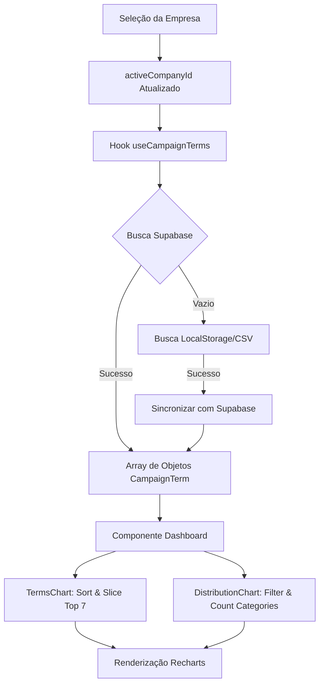

# Documentação Técnica: Funcionamento do Dashboard e Processamento de Dados

Esta documentação detalha o funcionamento interno do módulo **Dashboard**, explicando como os dados são cruzados, lidos e transformados em visualizações gráficas.

---

## 1. Funcionamento da Opção Dashboard

O Dashboard é a visão principal (view) disparada quando o usuário acessa uma empresa. Ele serve como um orquestrador de estado que:
1.  **Identifica o Contexto**: Através do `activeCompanyId` (armazenado no `localStorage` e gerenciado via `useState`), o sistema sabe exatamente de qual empresa deve buscar os dados.
2.  **Dispara a Busca (Fetch)**: O hook customizado `useCampaignTerms(activeCompanyId)` entra em ação sempre que o ID da empresa muda.
3.  **Renderiza Componentes**: Uma vez que os dados chegam, eles são distribuídos para os cartões de estatísticas (`EvervaultCard`), o gráfico de barras (`TermsChart`), o gráfico de pizza (`DistributionChart`) e a tabela principal (`DashboardTable`).

---

## 2. Cruzamento de Dados (Data Crossing)

O "cruzamento" de dados no Antygraviti OS ocorre em três camadas para garantir integridade e performance:

### **A. Isolamento por Tenant (Empresa)**
Cada registro no banco de dados (Supabase) possui uma coluna `company_id`. 
- Quando o dashboard solicita dados, ele aplica um filtro estrito: `.eq('company_id', activeCompanyId)`.
- Isso garante que os dados de uma empresa nunca "vazem" para outra durante a renderização.

### **B. Normalização de Cabeçalhos (Data Ingestion)**
Como os dados podem vir de fontes diferentes (CSV local, XLSX ou Google Sheets), a função `normalizeKey` (em `dataIngestion.ts`) transforma cabeçalhos variados em um padrão único:
- "Campanha", "Campaign Name" ou "campanha" → todos viram `campanha`.
- "Custo", "Cost" ou "investimento" → todos viram `custo`.

### **C. Sincronização Local vs. Cloud**
O sistema possui uma lógica de "failover":
1.  Tenta buscar no **Supabase** (Fonte da verdade).
2.  Se o banco estiver vazio, busca no **LocalStorage** (dados carregados via CSV/XLSX recentemente).
3.  Se encontrar dados locais, o sistema tenta sincronizá-los automaticamente com o Supabase (`insertCampaignTermsBatch`) para centralizar a informação.

---

## 3. Leitura e Transformação para Gráficos

Os gráficos não leem os dados "crus" diretamente. Existe uma camada de transformação que utiliza `useMemo` para processar os arrays de objetos e extrair apenas o necessário para a biblioteca **Recharts**.

### **Gráfico de Barras: Termos de Maior Custo (`TermsChart`)**
- **Processamento**:
    1.  Recebe o array completo de `CampaignTerm`.
    2.  Ordena o array pelo campo `custo` de forma decrescente (`sort`).
    3.  Corta o array para pegar apenas os **7 primeiros** (`slice(0, 7)`).
    4.  Mapeia para o formato do Recharts: `{ name: termo, cost: valor, clicks: valor }`.
- **Resultado**: Uma barra visual representando onde o orçamento está sendo mais consumido.

### **Gráfico de Pizza: Distribuição de Termos (`DistributionChart`)**
- **Processamento**:
    1.  O sistema executa filtros lógicos sobre o array total para contar ocorrências:
        - **Negativar**: Termos marcados com "❌" ou "true".
        - **Dúvidas**: Termos com observações ou campo "duvida" preenchido.
        - **Segmentar**: Termos com "✅" ou "⚠️".
        - **Teste A/B**: Termos marcados para experimento.
        - **Geral**: O restante dos termos (Data total - filtros acima).
    2.  Esses contadores são transformados no array `chartData` esperado pelo gráfico de pizza.
- **Resultado**: Uma visão macro da saúde da campanha e do volume de otimizações pendentes.

---

## 4. Fluxo de Dados Completo (Data Pipeline)

---
*© 2025 GOOGLAR — ANTYGRAVITI OS*
